# Accessibility Mode Implementation

## Accessibility Mode Implementation

### Colorblind-Safe Mode Specifications

**Purpose:** Make diagrams accessible for all color vision types (protanopia, deuteranopia, tritanopia, achromatopsia) while remaining clear for regular color vision.

#### Design Principles:
1. **Never rely on color alone** - always pair with patterns, shapes, or text
2. **Pattern-based differentiation** - use border styles as primary encoding
3. **Explicit text labels** - prefix all nodes with type indicators
4. **Shape coding** - use different node shapes for different categories
5. **High contrast borders** - all nodes have bold, visible borders

#### Mermaid Implementation:

#### Border Pattern System:

```mermaid
%%{init: {'theme':'base'}}%%
flowchart TD
    Keep["[✅ KEEP] Item"]
    Donate["[📦 DONATE] Item"]
    Maybe["[🤔 MAYBE] Item"]
    Break["[🛑 BREAK] Rest"]

    style Keep fill:#ffffff,stroke:#000000,stroke-width:3px,stroke-dasharray: 5 5
    style Donate fill:#ffffff,stroke:#000000,stroke-width:2px,stroke-dasharray: 10 5
    style Maybe fill:#ffffff,stroke:#000000,stroke-width:2px,stroke-dasharray: 2 2
    style Break fill:#ffffff,stroke:#000000,stroke-width:3px,stroke-dasharray: 1 4
```

#### Pattern Legend:
- `stroke-dasharray: 5 5` - Short dashes (KEEP items, positive actions)
- `stroke-dasharray: 10 5` - Long dashes (DONATE items, external actions)
- `stroke-dasharray: 2 2` - Dots (MAYBE items, uncertain states)
- `stroke-dasharray: 1 4` - Dot-dash (BREAK items, pauses)
- `stroke-width: 3px` - Critical importance
- `stroke-width: 2px` - Standard importance
- `stroke-width: 1px` - Detail level

#### Shape Coding:
- `([text])` - Rounded rectangle: Standard process steps
- `{text}` - Diamond: Decision points
- `[[text]]` - Hexagon-style: Critical deadlines
- `[/text/]` - Trapezoid: Break/rest states
- `>text]` - Asymmetric: External dependencies

#### Text Prefix System:
- `[✅ KEEP]` - Items to keep
- `[📦 DONATE]` - Items to donate/give away
- `[🤔 MAYBE]` - Uncertain decisions
- `[🛑 BREAK]` - Rest/break required
- `[⚠️ CRITICAL]` - Critical deadline or warning
- `[START]` - Starting point
- `[END]` - Completion point
- `[DECIDE]` - Decision point

#### Color Strategy:
- White fills (`#ffffff`) for all nodes
- Black borders (`#000000`) for maximum contrast
- Colors can be added for users with color vision, but information is encoded in patterns

### Monochrome Mode Specifications

**Purpose:** Optimize for black & white printing, photocopying, and e-ink displays where color is unavailable.

#### Design Principles:
1. **Pure black and white only** - no grays (print unreliably)
2. **Fill pattern hierarchy** - use patterns to show importance
3. **Border style differentiation** - solid/dashed/dotted for categories
4. **Verbose text labels** - more explicit than colorblind-safe mode
5. **Extra whitespace** - better print legibility

#### Mermaid Implementation:

#### Fill Pattern System:

```mermaid
%%{init: {'theme':'base'}}%%
flowchart TD
    Critical["[★ CRITICAL] Deadline"]
    High["[! HIGH] Important"]
    Medium["[→ MEDIUM] Standard"]
    Standard["[○ STANDARD] Normal"]

    style Critical fill:#000000,stroke:#000000,stroke-width:3px,color:#ffffff
    style High fill:#ffffff,stroke:#000000,stroke-width:3px
    style Medium fill:#ffffff,stroke:#000000,stroke-width:2px,stroke-dasharray: 10 5
    style Standard fill:#ffffff,stroke:#000000,stroke-width:2px
```

#### Fill Pattern Hierarchy:
- Solid black fill + white text: `fill:#000000,color:#ffffff` - Priority 1 (Critical)
- White fill + bold border: `fill:#ffffff,stroke-width:3px` - Priority 2 (High)
- White fill + dashed border: `stroke-dasharray: 10 5` - Priority 3 (Medium)
- White fill + solid border: Standard weight - Priority 4 (Standard)

#### Border Style System:
- `stroke-width:3px` + solid - Critical/deadlines
- `stroke-width:2px` + solid - Standard steps
- `stroke-dasharray: 10 5` - Optional/medium priority
- `stroke-dasharray: 5 5` - Maybe/uncertain
- `stroke-dasharray: 2 2` - Breaks/pauses

#### Text Prefix System (Verbose):
- `[★ CRITICAL DEADLINE]` - Critical with visual marker
- `[✓ KEEP]` - Text checkmark
- `[→ DONATE]` - Text arrow
- `[? MAYBE]` - Text question mark
- `[■ BREAK]` - Text square (stop sign)
- `[○ START]` - Text circle
- `[● END]` - Filled circle

#### Spacing Considerations:
- Use more vertical space between nodes
- Larger font sizes recommended (handled by ` ` for multi-line)
- Wide margins in flowchart layout

### Mode Combination Logic

#### When both base mode and accessibility mode are active:

1. **Base mode controls:**
   - Language tone (compassionate vs direct)
   - Time estimates (buffered vs standard)
   - Task granularity (micro-steps vs standard tasks)
   - Energy scaffolding (explicit vs minimal)

2. **Accessibility mode controls:**
   - Visual encoding (colors, patterns, shapes)
   - Border styles and thickness
   - Text prefix style
   - Fill patterns (monochrome only)

3. **Both modes respected simultaneously:**
   - Neurodivergent + Colorblind-Safe = ADHD-friendly language + pattern-based visuals
   - Neurodivergent + Monochrome = ADHD-friendly language + B&W print-optimized
   - Neurotypical + Colorblind-Safe = Efficient language + pattern-based visuals
   - Neurotypical + Monochrome = Efficient language + B&W print-optimized

#### Example Combined Output:

```mermaid
%%{init: {'theme':'base'}}%%
flowchart TD
    Start(["[○ START] Decision time<br/>(Take 3 seconds max)"])
    Q1{"[? DECIDE]<br/>Do I love it?<br/>(Not obligated)"}
    Keep["[✓ KEEP]<br/>Pack for move<br/>(Fits in new space)"]
    Donate["[→ DONATE]<br/>Helps someone else<br/>(Guilt-free)"]
    Break["[■ BREAK]<br/>Rest 10 min<br/>(Decision fatigue signal)"]

    Start --> Q1
    Q1 -->|YES| Keep
    Q1 -->|NO| Donate
    Q1 -->|UNSURE| Break

    style Start fill:#ffffff,stroke:#000000,stroke-width:3px
    style Q1 fill:#ffffff,stroke:#000000,stroke-width:2px
    style Keep fill:#ffffff,stroke:#000000,stroke-width:3px,stroke-dasharray: 5 5
    style Donate fill:#ffffff,stroke:#000000,stroke-width:2px,stroke-dasharray: 10 5
    style Break fill:#000000,stroke:#000000,stroke-width:3px,color:#ffffff
```

*This example shows: Neurodivergent language (compassionate, with parenthetical reassurance) + Monochrome visual encoding (B&W with patterns)*